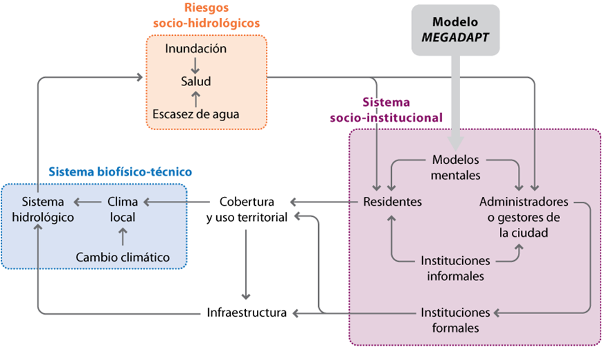
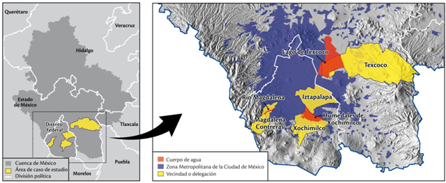

# Adaptación Dinámica Multi-Escalar en Megalópolis: Acción Autónoma, Cambio Institucional y Riesgo Socio- Hidrológico en la Ciudad de México (MEGADAPT)

Las megalópolis son "focos rojos" (hotspots) vulnerables al cambio
climático y enfrentan retos sociales e institucionales para su
adaptación. El proyecto MEGADAPT aborda el reto de reducir la
vulnerabilidad al cambio climático ante el aumento de inundaciones, la
escasez crónica de agua y los riesgos asociados a la salud en la
Ciudad de México, una de las zonas metropolitanas más grandes del
mundo. Los residentes, empresas y agencias públicas en las megalópolis
responden a estos retos de distintas maneras, y frecuentemente, poco
coordinadas. Las respuestas de estos actores causan un impacto en el
sistema hidro-climático, que a su vez, genera condiciones de riesgo
mediante modificaciones del entorno construido y del paisaje
biofísico. El objetivo general del proyecto es construir un modelo
dinámico integrado –MEGADAPT– para la Ciudad de México, que se podrá
aplicar a estrategias de adaptación ante los riesgos climáticos en
entornos complejos urbanos de todo el mundo. Asimismo, se explorará
cómo los diferentes escenarios de cambios extremos climáticos se
combinan con una serie de acciones dispersas de respuesta a la
vulnerabilidad en poblaciones específicas (por ejemplo, cambios en la
infraestructura o en el uso de suelo) para producir
retroalimentaciones cruzadas y escalares que alteran la distribución
de la vulnerabilidad en la megalópolis. A través de una herramienta de
soporte de decisiones, MEGADAPT permitirá a los tomadores de
decisiones experimentar cómo la modificación de las prioridades sobre
el manejo del riesgo, o de la ubicación geográfica de las
intervenciones ante condiciones de cambio climático, afectan la
equidad social y los riegos generales resultantes.

El proyecto se implementa en colaboración cercana con la Universidad
Estatal de Arizona (ASU) y los actores locales. Se caracterizará la
complejidad de las experiencias de residentes asociadas a riesgos y de
las estrategias de respuesta que estos desarrollan en tres casos de
estudio de regiones vulnerables dentro de la Ciudad de México
(Magdalena Contreras, Xochimilco e Iztapalapa). El análisis a nivel de
ciudad capturará el contexto institucional de la toma de decisiones y
mandatos, las estrategias de intervención y las prioridades de las
agencias y actores de la ciudad. Asimismo, se desarrollará un modelo
biofísico que simulará el impacto en el cambio del uso de suelo y las
modificaciones de la infraestructura en el sistema hidro-climático de
la ciudad. El modelo basado en agentes simulará las diversas
respuestas de los residentes y de las agencias a riesgos hidro-
climáticos con diferente ubicación espacial, lo que a su vez afecta la
respuesta del sistema hidro-climático. Un sistema de información
geográfico insertado en un marco teórico de análisis de decisiones
multicriterio (SIG- MCDA) permitirá la exploración de diferentes
escenarios de respuesta al riesgo, de una manera explícita y espacial,
facilitando la toma de decisiones relativas a la adaptación de las
condiciones hidro-climáticas cambiantes. El proyecto apoya la
formación de un grupo interdisciplinario e intercultural de
estudiantes de posgrado afiliados a la UNAM y a la ASU, y a través de
la participación directa de los actores locales involucrados, aspira a
mejorar las capacidades para el manejo del riesgo en la Ciudad de
México. Así, MEGADAPT pretende servir como un modelo de adaptación al
cambio climático para los países en desarrollo.

